## Setting up access to the dataset

I will be analyzing the gapminder dataset. First, load the `gapminder` R package. Also load tidyverse package - this will also load ggplot2 and dplyr.


```r
library(gapminder)
```

```
## Warning: package 'gapminder' was built under R version 3.5.1
```

```r
library(tidyverse)
```

```
## Warning: package 'tidyverse' was built under R version 3.5.1
```

```
## -- Attaching packages ----------------------------------------- tidyverse 1.2.1 --
```

```
## v ggplot2 3.0.0     v purrr   0.2.5
## v tibble  1.4.2     v dplyr   0.7.6
## v tidyr   0.8.1     v stringr 1.3.1
## v readr   1.1.1     v forcats 0.3.0
```

```
## Warning: package 'ggplot2' was built under R version 3.5.1
```

```
## Warning: package 'tibble' was built under R version 3.5.1
```

```
## Warning: package 'tidyr' was built under R version 3.5.1
```

```
## Warning: package 'readr' was built under R version 3.5.1
```

```
## Warning: package 'purrr' was built under R version 3.5.1
```

```
## Warning: package 'dplyr' was built under R version 3.5.1
```

```
## Warning: package 'stringr' was built under R version 3.5.1
```

```
## Warning: package 'forcats' was built under R version 3.5.1
```

```
## -- Conflicts -------------------------------------------- tidyverse_conflicts() --
## x dplyr::filter() masks stats::filter()
## x dplyr::lag()    masks stats::lag()
```

## Smell testing the data
Exploring the gapminder object, data frames:

1. Check the data structure of the dataset

```r
typeof(gapminder)
```

```
## [1] "list"
```

2. Check the class of the dataset

```r
class(gapminder)
```

```
## [1] "tbl_df"     "tbl"        "data.frame"
```

3. Find the number of columns

```r
ncol(gapminder)
```

```
## [1] 6
```

4. Find the number of rows

```r
nrow(gapminder)
```

```
## [1] 1704
```

5. Find dataset's dimensions by using the dim function

```r
dim(gapminder)
```

```
## [1] 1704    6
```

6. Display an internal structure of the dataset (an alternative to summary)

```r
str(gapminder)%>% 
  knitr::kable()
```

```
## Classes 'tbl_df', 'tbl' and 'data.frame':	1704 obs. of  6 variables:
##  $ country  : Factor w/ 142 levels "Afghanistan",..: 1 1 1 1 1 1 1 1 1 1 ...
##  $ continent: Factor w/ 5 levels "Africa","Americas",..: 3 3 3 3 3 3 3 3 3 3 ...
##  $ year     : int  1952 1957 1962 1967 1972 1977 1982 1987 1992 1997 ...
##  $ lifeExp  : num  28.8 30.3 32 34 36.1 ...
##  $ pop      : int  8425333 9240934 10267083 11537966 13079460 14880372 12881816 13867957 16317921 22227415 ...
##  $ gdpPercap: num  779 821 853 836 740 ...
```

## Exploring variables and their characteristics

The dataset consists of panel data: 3 quatitative variables (life expectancy, population and GDP per capita) are recorded from 1952 to 2007 for each country and the corresponding continent. Thus, we have 6 variables in total: 3 quantitative (`lifeExp`, `pop`, and `gdpPercap`), 2 categorical (`country`, `continent`) and the last one is `year`, which could be interpreted as quantitative or categorical depending on the purpose of the analysis. 

### Exploring a quantitative variable

We can measure various summary statistics (means, medians, max/min, etc.) for our quantitative variables by adding the variable name after $.

##### Life Expectancy
Find min, Q1, median, mean, Q3, max, standard deviation, and variance for the `lifeExp` variable

```r
summary(gapminder$lifeExp)
```

```
##    Min. 1st Qu.  Median    Mean 3rd Qu.    Max. 
##   23.60   48.20   60.71   59.47   70.85   82.60
```

```r
sd(gapminder$lifeExp)
```

```
## [1] 12.91711
```

```r
var(gapminder$lifeExp)
```

```
## [1] 166.8517
```


##### GDP per capita
Find min, Q1, median, mean, Q3, max, standard deviation, and variance for the `gdpPercap` variable

```r
summary(gapminder$gdpPercap)
```

```
##     Min.  1st Qu.   Median     Mean  3rd Qu.     Max. 
##    241.2   1202.1   3531.8   7215.3   9325.5 113523.1
```

```r
sd(gapminder$gdpPercap)
```

```
## [1] 9857.455
```

```r
var(gapminder$gdpPercap)
```

```
## [1] 97169410
```


##### Population
Find min, Q1, median, mean, Q3, max, standard deviation, and variance for the `pop` variable

```r
summary(gapminder$pop)
```

```
##      Min.   1st Qu.    Median      Mean   3rd Qu.      Max. 
## 6.001e+04 2.794e+06 7.024e+06 2.960e+07 1.959e+07 1.319e+09
```

```r
sd(gapminder$pop)
```

```
## [1] 106157897
```

```r
var(gapminder$pop)
```

```
## [1] 1.12695e+16
```


### Exploring a categorical variable

For categorical data, we can produce a contingency table that calculates counts for each combination of the categorical variable by using the table() function. 

##### Continent
Build a contingency table for the `continent` variable

```r
table(gapminder$continent)
```

```
## 
##   Africa Americas     Asia   Europe  Oceania 
##      624      300      396      360       24
```

We can also find proportions for each category  

```r
continent_prop <- table(gapminder$continent)
prop.table(continent_prop)
```

```
## 
##     Africa   Americas       Asia     Europe    Oceania 
## 0.36619718 0.17605634 0.23239437 0.21126761 0.01408451
```

##### Year
It wasn't initially clear whether the `year` variable was categorical or quantitative. Let's make a contingency table to see how many records for each year there is in the dataset.

Find contingency table for the `year` variable.

```r
table(gapminder$year)
```

```
## 
## 1952 1957 1962 1967 1972 1977 1982 1987 1992 1997 2002 2007 
##  142  142  142  142  142  142  142  142  142  142  142  142
```

We can notice here that data was collected only at 12 time-intervals that are five-years apart.

## Exploring various plot types

### Scatterplots

Scatterplot between `pop` and `gdpPercap` (colour-coded by year)

```r
ggplot(gapminder, aes(x=pop, y=gdpPercap, color=year)) + 
  geom_point()+
  xlab("Country population size") +
  ylab("GDP per capita") 
```

<!-- -->

Scatterplot between `gdpPercap` and `lifeExp`, color-coded by continent

```r
ggplot(gapminder, aes(gdpPercap, lifeExp, color=continent)) + 
  geom_point()+
  xlab("GDP per capita") +
  ylab("Average life expectancy") 
```

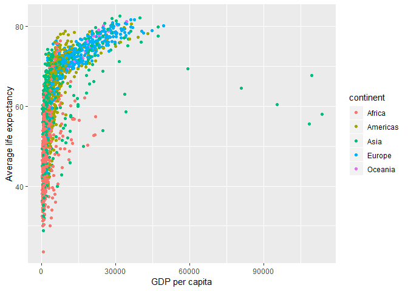<!-- -->

Scatterplot between `gdpPercap` and `lifeExp` (`gdpPercap` on a log scale), color-coded by continent

```r
ggplot(gapminder, aes(log(gdpPercap), lifeExp, color=continent)) + 
  geom_point()+
  xlab("Log of GDP per capita") +
  ylab("Average life expectancy") 
```

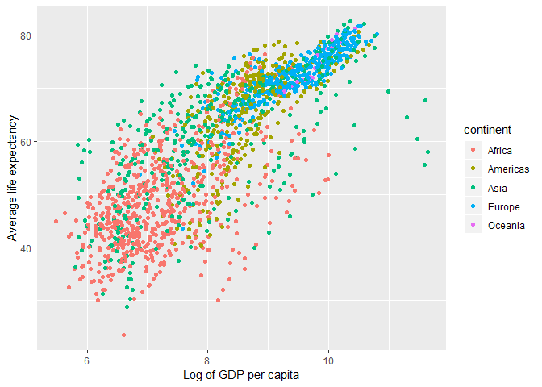<!-- -->

### Histograms and Kernel density plots

A plot of one quantitative variable. Maybe a histogram or densityplot or frequency polygon.

Build the histogram of`gdpPercap` with 50 bins

```r
ggplot(gapminder, aes(gdpPercap))+
  geom_histogram(bins=50, fill="blue")
```

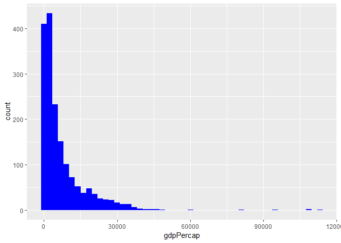<!-- -->


Create a kernel density plot for `gdpPercap`

```r
ggplot(gapminder, aes(gdpPercap))+
  geom_density(fill="red")
```

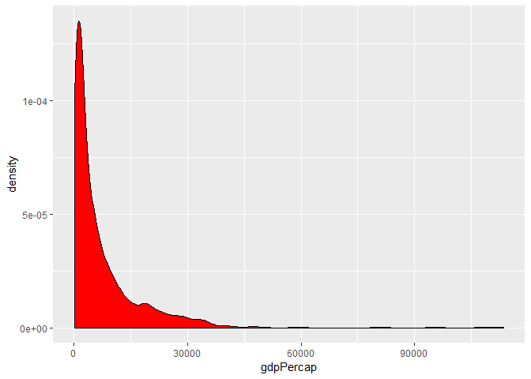<!-- -->

Overlap a kernel density plot with a histogram

```r
ggplot(gapminder, aes(gdpPercap))+
  geom_histogram(aes(y=..density..), bins=60, fill="pink") +
  geom_density()
```

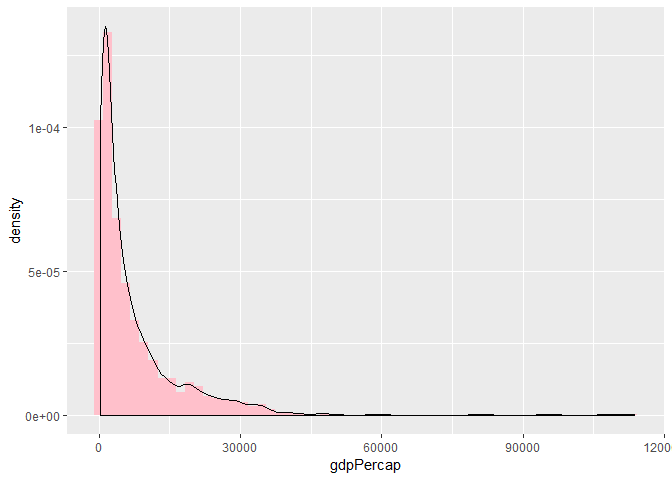<!-- -->

### Barcharts

Create a bar-chart for the `continent` variable

```r
ggplot(gapminder, aes(continent))+
geom_bar(fill="orange")
```

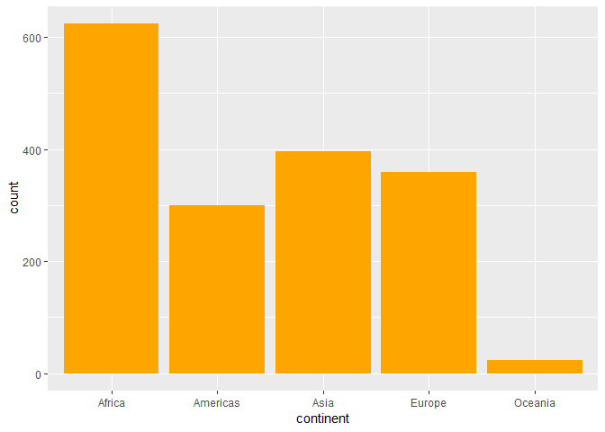<!-- -->

### Boxplots, violin and jitter plots

Make a boxplot of `lifeExp` for each continent

```r
ggplot(gapminder, aes(continent, lifeExp))+
  geom_boxplot(fill="purple")
```

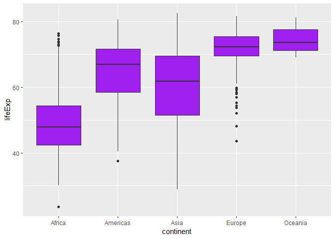<!-- -->

Make a boxplot of `gdpPercap` for each continent (log 10 scale for the GDP per capita variable)

```r
ggplot(gapminder, aes(continent, gdpPercap))+
  scale_y_log10()+
  geom_boxplot(fill="green")
```

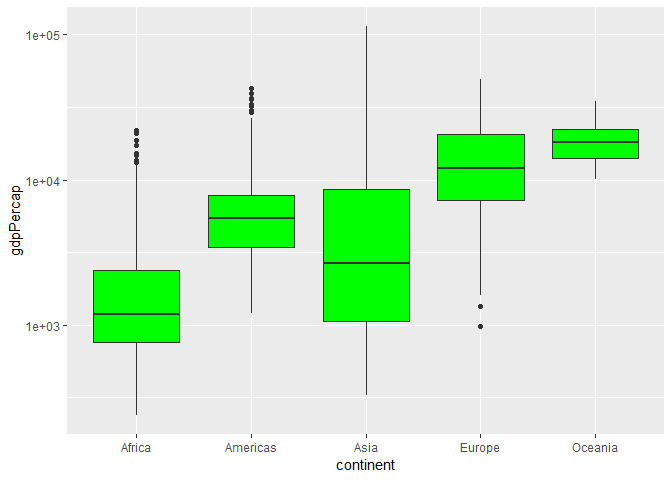<!-- -->

Make a violin plot of `gdpPercap` for each continent (log 10 scale for the GDP per capita variable)

```r
ggplot(gapminder, aes(continent, gdpPercap))+
  scale_y_log10()+
  geom_violin(fill="red")
```

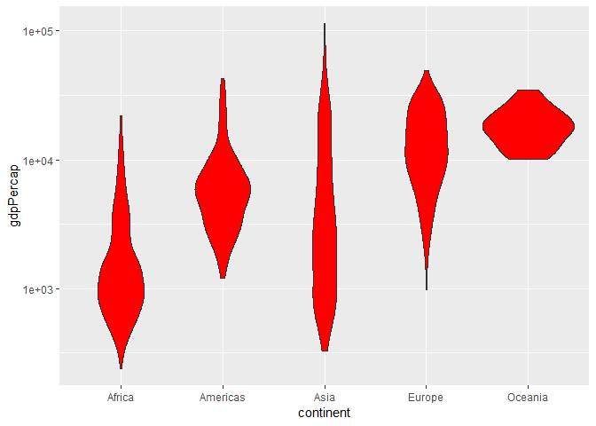<!-- -->

Add jitter plots to the violin plot of `gdpPercap`

```r
ggplot(gapminder, aes(continent, gdpPercap))+
  scale_y_log10()+
  geom_violin(fill="red")+
  geom_jitter(alpha=0.15)
```

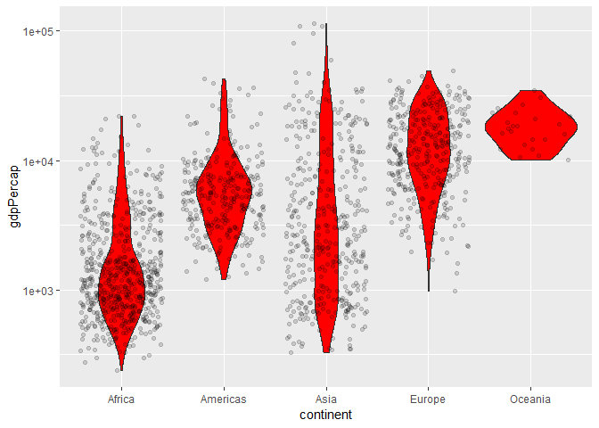<!-- -->


## Using filter(), select() and %>%

### `filter()`, `arrange()` and `select()` functions

1. Only select data with `gdpPercap` greater than 30,000. 

```r
gapminder %>% 
  filter(gdpPercap  > 30000) %>% 
  knitr::kable()
```

```
## Warning: package 'bindrcpp' was built under R version 3.5.1
```


country            continent    year   lifeExp         pop   gdpPercap
-----------------  ----------  -----  --------  ----------  ----------
Australia          Oceania      2002    80.370    19546792    30687.75
Australia          Oceania      2007    81.235    20434176    34435.37
Austria            Europe       2002    78.980     8148312    32417.61
Austria            Europe       2007    79.829     8199783    36126.49
Belgium            Europe       2002    78.320    10311970    30485.88
Belgium            Europe       2007    79.441    10392226    33692.61
Canada             Americas     2002    79.770    31902268    33328.97
Canada             Americas     2007    80.653    33390141    36319.24
Denmark            Europe       2002    77.180     5374693    32166.50
Denmark            Europe       2007    78.332     5468120    35278.42
Finland            Europe       2007    79.313     5238460    33207.08
France             Europe       2007    80.657    61083916    30470.02
Germany            Europe       2002    78.670    82350671    30035.80
Germany            Europe       2007    79.406    82400996    32170.37
Hong Kong, China   Asia         2002    81.495     6762476    30209.02
Hong Kong, China   Asia         2007    82.208     6980412    39724.98
Iceland            Europe       2002    80.500      288030    31163.20
Iceland            Europe       2007    81.757      301931    36180.79
Ireland            Europe       2002    77.783     3879155    34077.05
Ireland            Europe       2007    78.885     4109086    40676.00
Japan              Asia         2007    82.603   127467972    31656.07
Kuwait             Asia         1952    55.565      160000   108382.35
Kuwait             Asia         1957    58.033      212846   113523.13
Kuwait             Asia         1962    60.470      358266    95458.11
Kuwait             Asia         1967    64.624      575003    80894.88
Kuwait             Asia         1972    67.712      841934   109347.87
Kuwait             Asia         1977    69.343     1140357    59265.48
Kuwait             Asia         1982    71.309     1497494    31354.04
Kuwait             Asia         1992    75.190     1418095    34932.92
Kuwait             Asia         1997    76.156     1765345    40300.62
Kuwait             Asia         2002    76.904     2111561    35110.11
Kuwait             Asia         2007    77.588     2505559    47306.99
Netherlands        Europe       1997    78.030    15604464    30246.13
Netherlands        Europe       2002    78.530    16122830    33724.76
Netherlands        Europe       2007    79.762    16570613    36797.93
Norway             Europe       1987    75.890     4186147    31540.97
Norway             Europe       1992    77.320     4286357    33965.66
Norway             Europe       1997    78.320     4405672    41283.16
Norway             Europe       2002    79.050     4535591    44683.98
Norway             Europe       2007    80.196     4627926    49357.19
Saudi Arabia       Asia         1977    58.690     8128505    34167.76
Saudi Arabia       Asia         1982    63.012    11254672    33693.18
Singapore          Asia         1997    77.158     3802309    33519.48
Singapore          Asia         2002    78.770     4197776    36023.11
Singapore          Asia         2007    79.972     4553009    47143.18
Sweden             Europe       2007    80.884     9031088    33859.75
Switzerland        Europe       1987    77.410     6649942    30281.70
Switzerland        Europe       1992    78.030     6995447    31871.53
Switzerland        Europe       1997    79.370     7193761    32135.32
Switzerland        Europe       2002    80.620     7361757    34480.96
Switzerland        Europe       2007    81.701     7554661    37506.42
United Kingdom     Europe       2007    79.425    60776238    33203.26
United States      Americas     1992    76.090   256894189    32003.93
United States      Americas     1997    76.810   272911760    35767.43
United States      Americas     2002    77.310   287675526    39097.10
United States      Americas     2007    78.242   301139947    42951.65


2. Of those, only take data from Europe or Americas between 1995 and 2005.

```r
gapminder %>% 
  filter(gdpPercap  > 30000) %>% 
  filter(continent == "Europe" | continent == "Americas" ) %>% 
  filter(year>1995 & year<2005)%>% 
  knitr::kable()
```


country         continent    year   lifeExp         pop   gdpPercap
--------------  ----------  -----  --------  ----------  ----------
Austria         Europe       2002    78.980     8148312    32417.61
Belgium         Europe       2002    78.320    10311970    30485.88
Canada          Americas     2002    79.770    31902268    33328.97
Denmark         Europe       2002    77.180     5374693    32166.50
Germany         Europe       2002    78.670    82350671    30035.80
Iceland         Europe       2002    80.500      288030    31163.20
Ireland         Europe       2002    77.783     3879155    34077.05
Netherlands     Europe       1997    78.030    15604464    30246.13
Netherlands     Europe       2002    78.530    16122830    33724.76
Norway          Europe       1997    78.320     4405672    41283.16
Norway          Europe       2002    79.050     4535591    44683.98
Switzerland     Europe       1997    79.370     7193761    32135.32
Switzerland     Europe       2002    80.620     7361757    34480.96
United States   Americas     1997    76.810   272911760    35767.43
United States   Americas     2002    77.310   287675526    39097.10

3. Only showcase country name, year and GDP per capita for selected countries. Arrange data by year from smallest to largest GDP per capita.

```r
gapminder %>% 
  filter(gdpPercap  > 30000) %>% 
  filter(continent == "Europe" | continent == "Americas" ) %>% 
  filter(year>1995 & year<2005)  %>% 
  select(country, year, gdpPercap) %>% 
  arrange(year, gdpPercap)%>% 
  knitr::kable()
```


country          year   gdpPercap
--------------  -----  ----------
Netherlands      1997    30246.13
Switzerland      1997    32135.32
United States    1997    35767.43
Norway           1997    41283.16
Germany          2002    30035.80
Belgium          2002    30485.88
Iceland          2002    31163.20
Denmark          2002    32166.50
Austria          2002    32417.61
Canada           2002    33328.97
Netherlands      2002    33724.76
Ireland          2002    34077.05
Switzerland      2002    34480.96
United States    2002    39097.10
Norway           2002    44683.98


### Time plots
Make a time plot of American `gdpPercap` over time

```r
gapminder %>% 
  filter(country == "United States") %>% 
  ggplot(aes(year, gdpPercap))+
  geom_point()+
  geom_line()
```

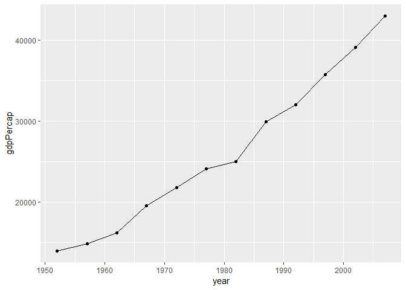<!-- -->

Make a timeplot of `gdpPercap` for countries with population between 5m and 20m located in Asia

```r
gapminder %>% 
  filter(pop>5000000 & pop < 20000000)  %>% 
  filter(continent == "Asia") %>% 
  ggplot(aes(year, gdpPercap, color=country))+
  geom_point()+
  geom_line()
```

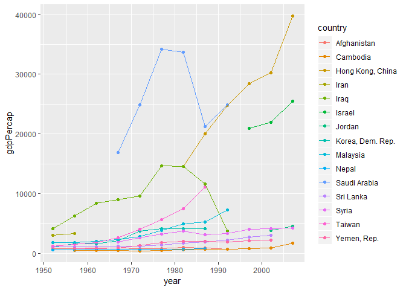<!-- -->

### Scatterplots
Make a scatterplot of `gdpPercap` and `lifeExp` for European countries between 1970 and 1994, add a smoothing function, color code by year.

```r
gapminder %>% 
  filter(continent == "Europe") %>% 
  filter(year>1970 & year<1994)  %>% 
  ggplot(aes(gdpPercap, lifeExp, color=year))+
  geom_point()+
  geom_smooth()
```

```
## `geom_smooth()` using method = 'loess' and formula 'y ~ x'
```

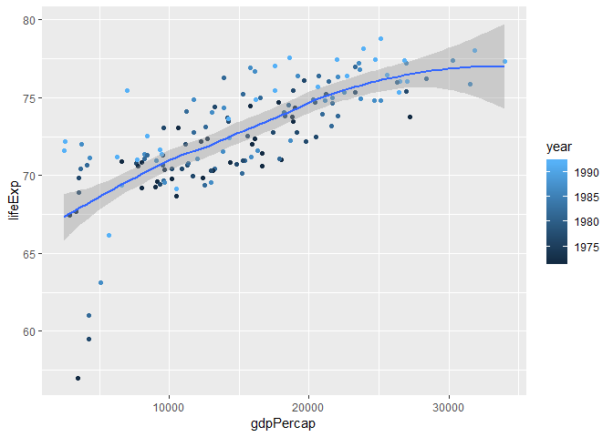<!-- -->


## But I want to do more!

Evaluate this code: 

```r
filter(gapminder, country == c("Rwanda", "Afghanistan"))%>% 
  knitr::kable()
```


country       continent    year   lifeExp        pop   gdpPercap
------------  ----------  -----  --------  ---------  ----------
Afghanistan   Asia         1957    30.332    9240934    820.8530
Afghanistan   Asia         1967    34.020   11537966    836.1971
Afghanistan   Asia         1977    38.438   14880372    786.1134
Afghanistan   Asia         1987    40.822   13867957    852.3959
Afghanistan   Asia         1997    41.763   22227415    635.3414
Afghanistan   Asia         2007    43.828   31889923    974.5803
Rwanda        Africa       1952    40.000    2534927    493.3239
Rwanda        Africa       1962    43.000    3051242    597.4731
Rwanda        Africa       1972    44.600    3992121    590.5807
Rwanda        Africa       1982    46.218    5507565    881.5706
Rwanda        Africa       1992    23.599    7290203    737.0686
Rwanda        Africa       2002    43.413    7852401    785.6538

This code produces data entries for Rwanda and Afganistan such that the timelines don't overlap (e.g. the year 1957 has data only on one country not both), i.e. half of the data ends up being missing.

Correct way to do this:

```r
gapminder %>% 
  filter(country=="Rwanda"| country=="Afghanistan") %>% 
  knitr::kable()
```


country       continent    year   lifeExp        pop   gdpPercap
------------  ----------  -----  --------  ---------  ----------
Afghanistan   Asia         1952    28.801    8425333    779.4453
Afghanistan   Asia         1957    30.332    9240934    820.8530
Afghanistan   Asia         1962    31.997   10267083    853.1007
Afghanistan   Asia         1967    34.020   11537966    836.1971
Afghanistan   Asia         1972    36.088   13079460    739.9811
Afghanistan   Asia         1977    38.438   14880372    786.1134
Afghanistan   Asia         1982    39.854   12881816    978.0114
Afghanistan   Asia         1987    40.822   13867957    852.3959
Afghanistan   Asia         1992    41.674   16317921    649.3414
Afghanistan   Asia         1997    41.763   22227415    635.3414
Afghanistan   Asia         2002    42.129   25268405    726.7341
Afghanistan   Asia         2007    43.828   31889923    974.5803
Rwanda        Africa       1952    40.000    2534927    493.3239
Rwanda        Africa       1957    41.500    2822082    540.2894
Rwanda        Africa       1962    43.000    3051242    597.4731
Rwanda        Africa       1967    44.100    3451079    510.9637
Rwanda        Africa       1972    44.600    3992121    590.5807
Rwanda        Africa       1977    45.000    4657072    670.0806
Rwanda        Africa       1982    46.218    5507565    881.5706
Rwanda        Africa       1987    44.020    6349365    847.9912
Rwanda        Africa       1992    23.599    7290203    737.0686
Rwanda        Africa       1997    36.087    7212583    589.9445
Rwanda        Africa       2002    43.413    7852401    785.6538
Rwanda        Africa       2007    46.242    8860588    863.0885


